# Docker搭建Jenkins

# Jenkins系統需求

有了上次搭建Gitlab的經驗，這次學乖了，先查一下Jenkins的系統需求

這樣看起來阿里雲上2核2G的ECS應該可以裝看看

[官方文檔](https://www.jenkins.io/zh/doc/book/installing/)

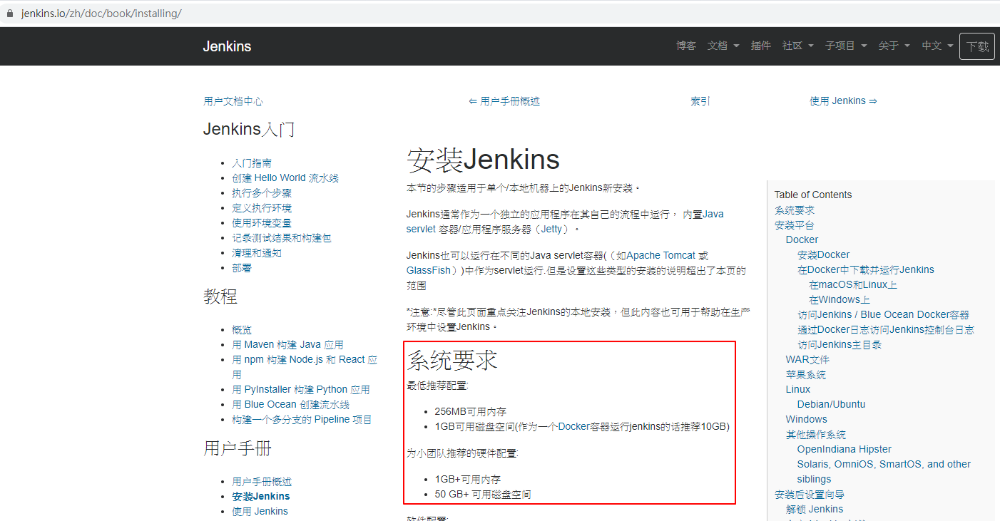

# 撰寫shell腳本

安裝時，數據卷掛載的資料夾/var/jenkins_home是以"jenkins"為使用者去存取，會因為權限不夠的問題，需先在該資料夾建立完成，修改權限給一般使用者也能存取

pre_install_jenkins.sh
```shell
#!/bin/bash

mkdir -p /var/jenkins_home
chown -R 1000:1000 /var/jenkins_home
```


# 撰寫docker-compose.yml

```shell
version: '3.2'
services:
  jenkins:
    image: 'jenkins/jenkins:lts'
    container_name: jenkins
    restart: always
    ports:
      - '28080:8080'
      - '50000:50000'
    volumes:
      - /var/jenkins_home:/var/jenkins_home
      - /var/run/docker.sock:/var/run/docker.sock
```

# 建立工作資料夾

```shell
cd /home/
mkdir jenkins
cd jenkins/
```

撰寫上述兩樣文件，最後資料夾應該如圖，有這兩個檔案

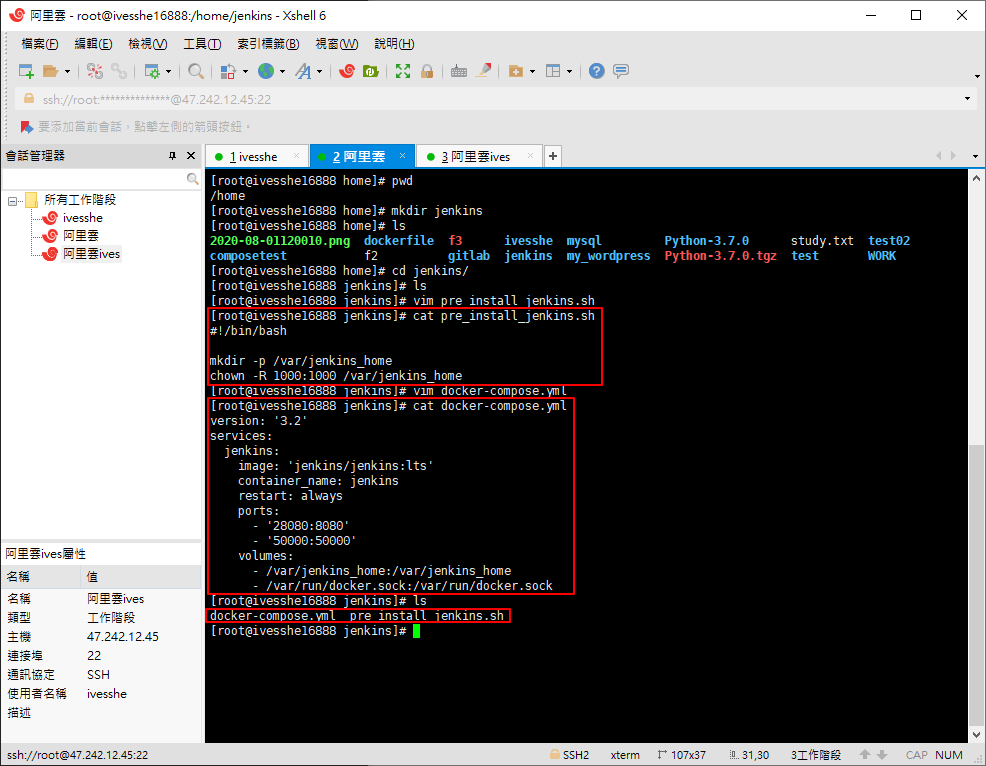

# 執行pre_install_jenkins.sh及啟動docker-compose

```shell
# 給腳本授權，u代表所有者，x代表執行權限， + 表示增加權限
chmod u+x pre_install_jenkins.sh

# 執行腳本，創建Jenkins的數據卷目錄
./pre_install_jenkins.sh

# 啟動docker-compose，創建Jenkins容器
docker-compose up -d
```

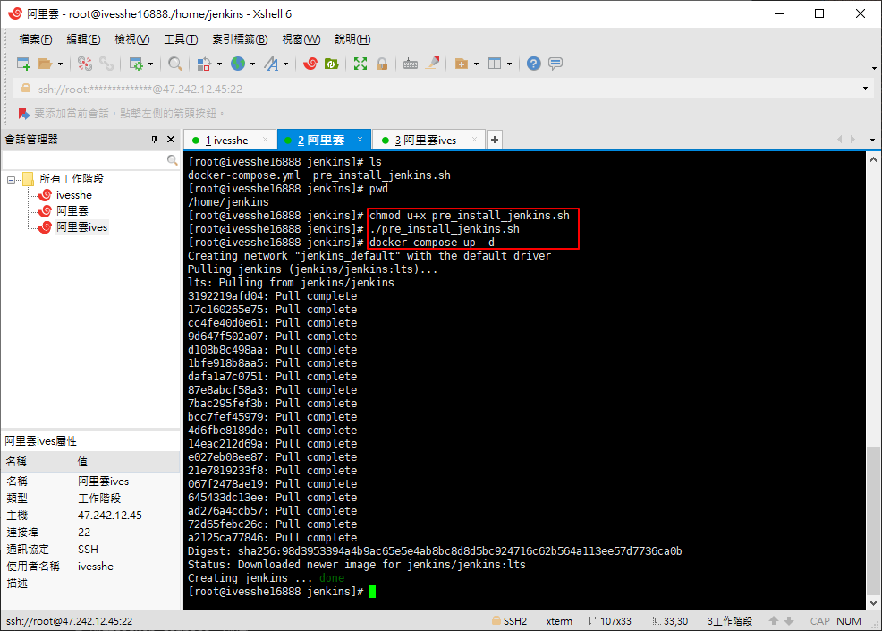

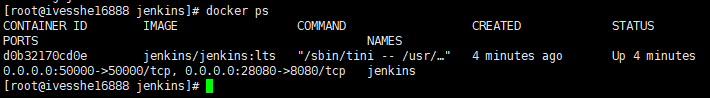

# 阿里雲安全組設定新增端口

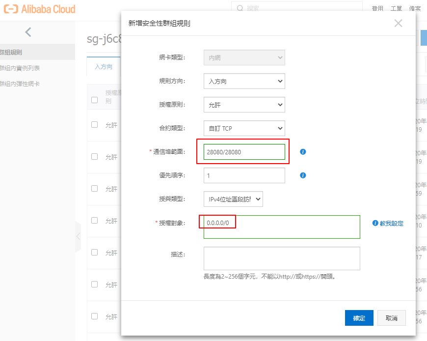

# 進入Jenkins

要照指示去該資料夾找密碼

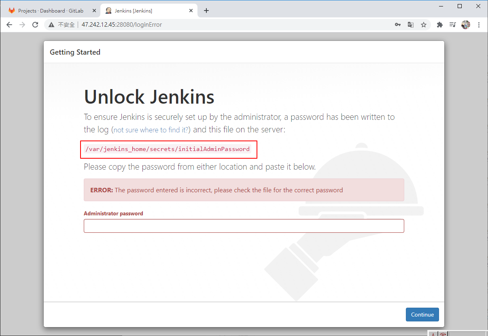

因為該資料夾已被掛載數據卷到本機的相同目錄，在本機上找即可

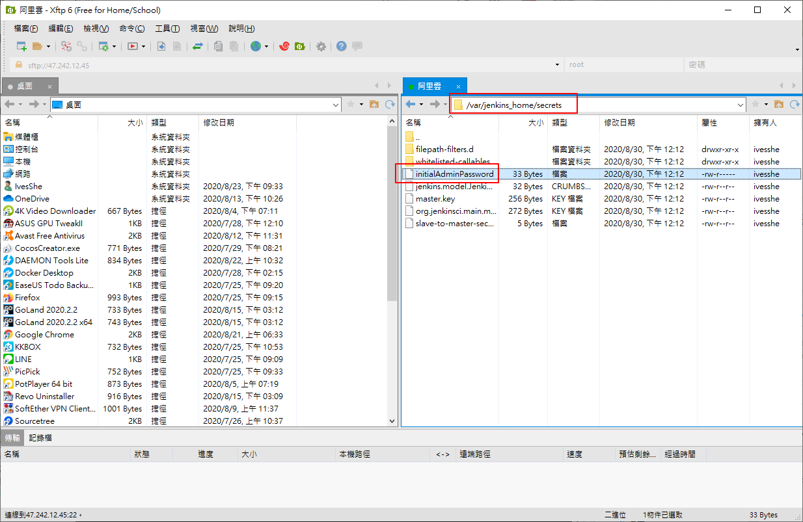

# 順利進入，並安裝插件

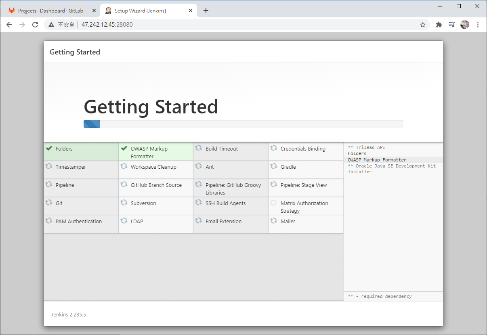

# 安裝完成，建立帳戶

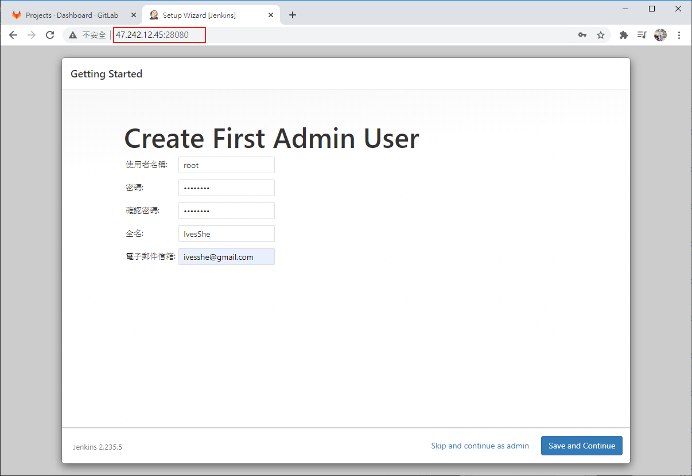

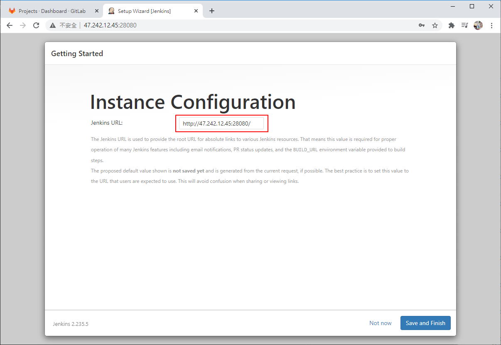

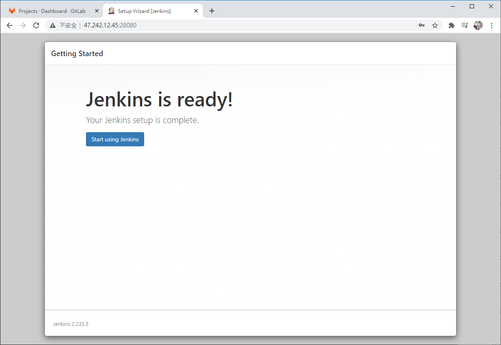

# 進入畫面

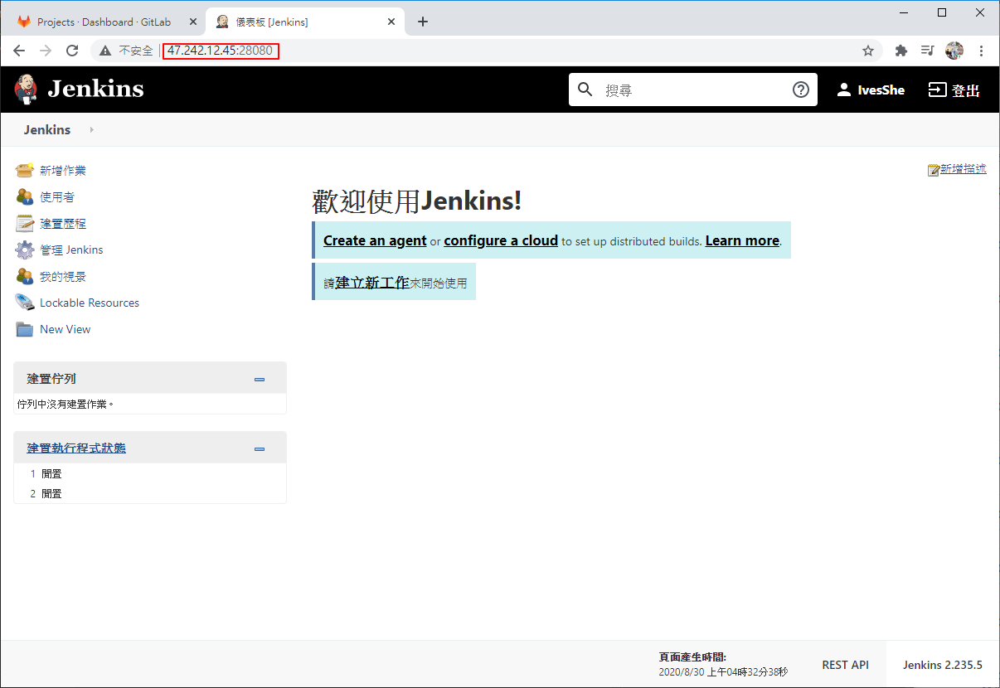

